```sql
-- Customers Table
CREATE TABLE Customers (
    CustomerID INT PRIMARY KEY,
    FirstName VARCHAR(20),
    LastName VARCHAR(20) ,
    Email VARCHAR(30) ,
    Phone VARCHAR(12),
    Address VARCHAR(100)
);

-- Products Table
CREATE TABLE Products (
    ProductID INT PRIMARY KEY ,
    ProductName VARCHAR(30) ,
    Description VARCHAR(100),
    Price DECIMAL(10, 2) 
);

-- Orders Table
CREATE TABLE Orders (
    OrderID INT PRIMARY KEY ,
    CustomerID INT FOREIGN KEY REFERENCES Customers(CustomerID),
    OrderDate DATETIME ,
    TotalAmount DECIMAL(10, 2) 
);

-- OrderDetails Table
CREATE TABLE OrderDetails (
    OrderDetailID INT PRIMARY KEY ,
    OrderID INT FOREIGN KEY REFERENCES Orders(OrderID),
    ProductID INT FOREIGN KEY REFERENCES Products(ProductID),
    Quantity INT 
);

-- Inventory Table
CREATE TABLE Inventory (
    InventoryID INT PRIMARY KEY ,
    ProductID INT FOREIGN KEY REFERENCES Products(ProductID),
    QuantityInStock INT ,
    LastStockUpdate DATETIME 
);
```

```sql
-- Insert records into Customers table
INSERT INTO Customers (FirstName, LastName, Email, Phone, Address)
VALUES
('John', 'Doe', 'john.doe@example.com', '1234567890', '123 Main St'),
('Jane', 'Smith', 'jane.smith@example.com', '0987654321', '456 Elm St'),
('Jim', 'Brown', 'jim.brown@example.com', '5551234567', '789 Oak St');

-- Insert records into Products table
INSERT INTO Products (ProductName, Description, Price)
VALUES
('Laptop', '15 inch gaming laptop', 1200.00),
('Smartphone', 'Latest model smartphone', 800.00),
('Headphones', 'Noise cancelling headphones', 150.00);

-- Insert records into Orders table
INSERT INTO Orders (CustomerID, OrderDate, TotalAmount)
VALUES
(1, '2024-06-10', 1350.00),
(2, '2024-06-11', 800.00),
(3, '2024-06-12', 1200.00);

-- Insert records into OrderDetails table
INSERT INTO OrderDetails (OrderID, ProductID, Quantity)
VALUES
(1, 1, 1), -- 1 Laptop
(1, 3, 1), -- 1 Headphones
(2, 2, 1), -- 1 Smartphone
(3, 1, 1); -- 1 Laptop

-- Insert records into Inventory table
INSERT INTO Inventory (ProductID, QuantityInStock, LastStockUpdate)
VALUES
(1, 50, '2024-06-01'), -- 50 Laptops in stock
(2, 30, '2024-06-01'), -- 30 Smartphones in stock
(3, 100, '2024-06-01'); -- 100 Headphones in stock
```


```sql
-- 1. Write an SQL query to retrieve the names and emails of all customers.
SELECT CONCAT(FirstName,' ',LastName) AS Name,  Email   
FROM Customers
```
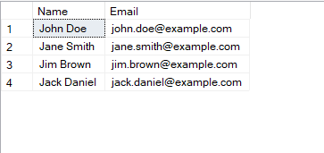
```sql
-- 2. Write an SQL query to list all orders with their order dates and corresponding customer names.
SELECT CONCAT(c.FirstName,' ',c.LastName) AS CustomerName,o.OrderID,o.OrderDate FROM orders o
JOIN Customers c
ON o.CustomerID = c.CustomerID 
```
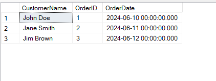
```sql
-- 3. Write an SQL query to insert a new customer record into the "Customers" table. Include customer information such as name, email, and address.
INSERT INTO Customers(CustomerID,FirstName,LastName,Email,Phone,Address) VALUES 
(4,'Jack','Daniel','jack.daniel@example.com',9512346785,'147 Down Town')

SELECT * FROM Customers
```
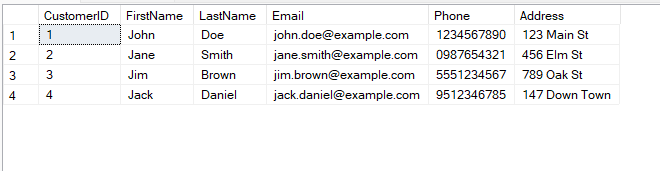
```sql
-- 4. Write an SQL query to update the prices of all electronic gadgets in the "Products" table by increasing them by 10%.
UPDATE Products
SET Price = Price + (Price * 0.1)

SELECT * FROM Products
```
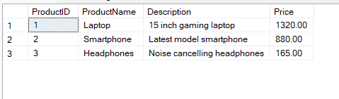
```sql
-- 5. Write an SQL query to delete a specific order and its associated order details from the "Orders" and "OrderDetails" tables. Allow users to input the order ID as a parameter.


SELECT * FROM Orders
SELECT * FROM OrderDetails

DECLARE @oid INT
SET @oid = 1
DELETE FROM Orders
WHERE OrderID = @oid
DELETE FROM OrderDetails
WHERE OrderID = @oid
```
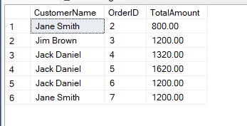

```sql
-- 6. Write an SQL query to insert a new order into the "Orders" table. Include the customer ID, order date, and any other necessary information.
INSERT INTO Orders VALUES
(4, 4, '2024-06-14 00:00:00.000', 1320.00)

INSERT INTO OrderDetails VALUES
(5, 4, 1, 1)

SELECT * FROM Orders
SELECT * FROM OrderDetails
```
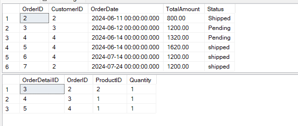
```sql
-- 7. Write an SQL query to update the contact information (e.g., email and address) of a specific customer in the "Customers" table. Allow users to input the customer ID and new contact information.
DECLARE @custid
SET @custid = 3
UPDATE Customers
SET Email = 'updated.mail@example.com',
	Address = '098 abc st'
WHERE CustomerID = @custid
```
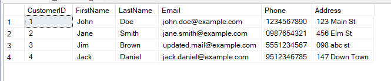
```sql
-- 8. Write an SQL query to recalculate and update the total cost of each order in the "Orders" table based on the prices and quantities in the "OrderDetails" table.

-- 9. Write an SQL query to delete all orders and their associated order details for a specific customer from the "Orders" and "OrderDetails" tables. Allow users to input the customer ID as a parameter.
DELETE FROM OrderDetails
WHERE OrderID = 1

DELETE FROM Orders
WHERE CustomerID = 1
```
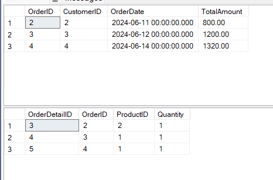
```sql
-- 10. Write an SQL query to insert a new electronic gadget product into the "Products" table, including product name, category, price, and any other relevant details.
INSERT INTO Products VALUES
(4, 'Smartwatch', 'Bluetooth calling watch', 200)

SELECT * FROM Products
```
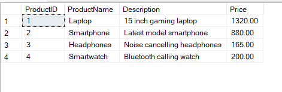
```sql
-- 11. Write an SQL query to update the status of a specific order in the "Orders" table (e.g., from "Pending" to "Shipped"). Allow users to input the order ID and the new status.
DECLARE @statusmsg VARCHAR(10)
SET @statusmsg = 'Shipped'

DECLARE @ordid INT
SET @ordid = 2

ALTER TABLE Orders
ADD Status VARCHAR(10);

SELECT * FROM Orders

UPDATE Orders
SET "Status" = @statusmsg
WHERE OrderID = @ordid

SELECT * FROM Orders
```
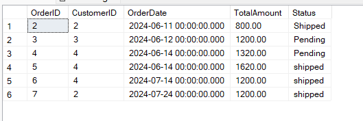
```sql
-- 12. Write an SQL query to calculate and update the number of orders placed by each customer in the "Customers" table based on the data in the "Orders" table.
alter table customers add Count_of_Orders int default 0 ;

update Customers
set Customers.Count_of_Orders=new.No_Of_Orders 
from Customers c
JOIN (select CustomerID,count(OrderID) as No_Of_Orders 
	  from Orders 
	  group by CustomerID) as new
	  ON c.CustomerID = new.CustomerID
```

```sql
-- 13. Write an SQL query to retrieve a list of all orders along with customer information (e.g., customer name) for each order.
SELECT CONCAT(c.FirstName,' ',c.LastName) AS CustomerName,o.OrderID,o.TotalAmount
FROM Orders o
LEFT JOIN Customers c
ON c.CustomerID = o.CustomerID

```
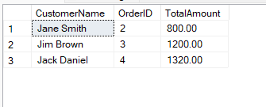
```sql
-- 14. Write an SQL query to find the total revenue generated by each electronic gadget product. Include the product name and the total revenue.
SELECT ProductName,SUM(p.Price * od.Quantity) as total From Orders o
JOIN OrderDetails od
ON o.OrderID = od.OrderID
JOIN Products p
ON p.ProductID = od.ProductID	
group by p.ProductName
```
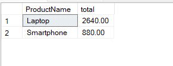
-- 15. Write an SQL query to list all customers who have made at least one purchase. Include their names and contact information.
SELECT CONCAT(c.FirstName,' ',c.LastName) AS CustomerName, c.Phone FROM Customers c
JOIN Orders o
ON c.CustomerID = o.CustomerID
JOIN OrderDetails od
ON o.OrderID = od.OrderID
WHERE EXISTS (SELECT OrderID FROM OrderDetails)
```